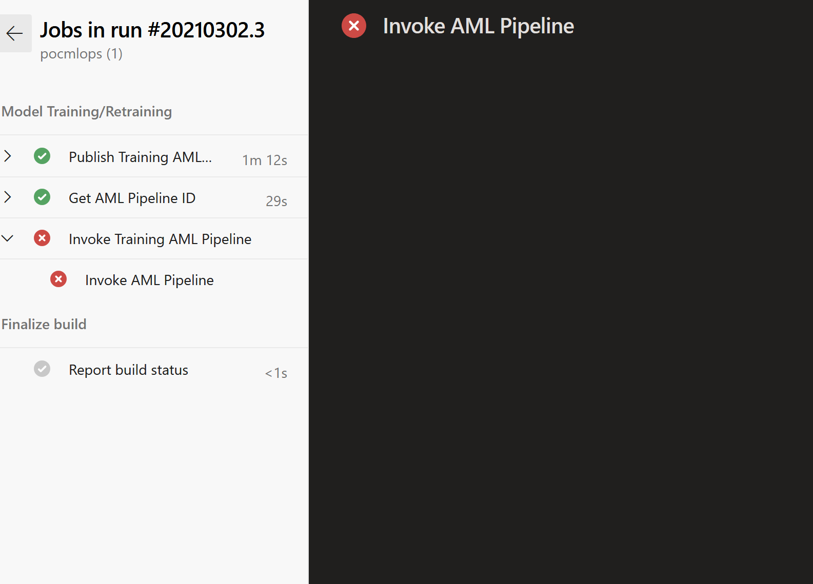

# End to end setup

This page describes how to reuse the template in your own project. The setup consists in three steps: configure azure devops, modifying some configuration variables for your infrastructure, and then running azure devops pipelines to create the infrastructure and running the CI/CD pipelines.

We also provide an FAQ section to support you in fine-tuning the template to your requirements

[[_TOC_]]

## Configuring your Azure Devops

Create a service connection to your Azure subscription. This will enable the Azure pipelines to create the infrastructure and to send the code to your AML services. To do so, go to:

1. Project settings and click on Service Connection <br> 

2. Click on _New service connection_, _Azure Resource Manager_, then _Next_

3. Click on _Service Principal (automatic)_, then _next_. Now, you should be here: <br> 

4. Select your subscription where you want to deploy your resources. Leave **Resource group blank (!)**.  Add the name of your service connection. By default, in the configuration file, we use _conn-mlops-sub-infra_. Click on **Grant access permission to all pipelines (!)**

Change the variables in the configuration files.

1. Go [_configuration/configuration-infra-DEV_](.../../../../configuration/configuration-infra-DEV.variables.yml)
2. Add the name of your service connection to _SERVICECONNECTION_RG_
3. Change the NAMESPACE variable to unique name for your AML resources. This is used during infra creation. For instance, if you use "MLOPS" as NAMESPACE, your AML resources will be named amlMLOPS. Make sure you don't have existing resources with the same name in your subscriptions.
4. (Optional) change the Azure location for your resources in _LOCATION_
5. Repeat (2), (3) for the file [_configuration/configuration-infra-PRD_](.../../../../configuration/configuration-infra-PRD.variables.yml).

Finally, create a *_develop_ branch* and push the same code to your new branch. The CI/CD pipelines have some internal logic to deploy your code either to DEV or PROD depending on the branch you use to push new code to.

## Creating the infrastructure

If you have followed the steps before, you can now create your infrastructure automatically. To do so, in your Azure DevOps Project:

1. Go to _Pipelines_ and click on _New Pipeline_ <br> 
   
2. Click on _Azure Repos Git_ <br> 
3. Select the repository where you have pushed your code.
4. Select _Existing Azure Pipelines YAML file_ <br> 
5. In _Branch_ select *_develop_*, In _Path_, select _azure_pipelines/PIPELINE-0-Setup.yml_
6. Click on continue and click on run
7. (Optional) if you also want to create a PRD environment, you can run the same pipeline as before. Go to pipelines, select the pipeline you just run, and then click on _run pipeline_. In the pop up window, select 'main' in _Branch_ <br> 

The Azure pipeline will create a DEV and PROD resource group, with all the AML artifacts (keyvault, blobstorage, etc). Also, the pipeline will create some compute targets and AKS to use for respectively model training and model deployment. All the resources and compute targets can be customized (what to deploy, where, etc) once you have a good understanding of _PIPELINE-0-Setup.yml_.

## Running the CI/CD pipeline

If you have managed to generate the infrastructure, you now have to add the final configurations to be able to run the CI/CD Pipeline. To do so:

1. Add the AML extension to your Azure DevOps. This will enable Azure DevOps to run your AML pipelines.
   1. Go to the marketplace and click on _browse marketplace_ <br> 
   2. Search for Azure Machine learning. Here the direct link: <https://marketplace.visualstudio.com/items?itemName=ms-air-aiagility.vss-services-azureml>
   3. Click on _Get it free_
   4. Select your Azure DevOps Organisation <br> 


2. Create a service connection to your DEV and PRD AML service:
   1. Go back to your project settings.
   2. Create a new service connection but this time choose _Machine Learning Workspace_ 
   3. Use the same subscription where you deployed you infrastructure, select the resource group that was created for you infrastructure (by default it should be **rg-mlops-dev-001**)
 
3. Train a model and deploy the model. As you did in **Creating the infrastructure**, follow the step to create a new Azure pipeline. This time, in _branch_ select *develop* and for _Path_, select _azure_pipelines/PIPELINE-1-modelling.yml_.

4. (Optional) Run the pipeline in PRD. Run the same pipeline as before but, in _Branch_, select *main* (or master depending on your setup)
5. (Optional) run the batch inference pipeline. If you want to run some offline batch inference, you can run the pipeline _azure_pipelines/PIPELINE-2-batchinference.yml_

## FAQ


## When running the ADO training pipeline, the pipeline fails at the _invoke_ step

If you see the error below. You have to ensure that the service connection is created at the Azure Machine Learning Workspace level and not Subscription level




### I already have an infrastructure

You will have to:

1. Create two service connection to your AML workspaces (1 for DEV, 1 for PRD)

2. Add the AML extension to your Azure DevOps organisation from marketplace

3. Update the configuration-infra-DEV.variables.yml with your own resources. In _configuration/compute_, add your compute configuration if any

4. In configuration-aml.variables.yml update the compute name if necessary.

### I have a different branching strategy

You could change the conditions in the pipeline by adding condition tags like 
```
condition: eq(variables['build.sourceBranch'], 'refs/heads/main')
```

or you can also decide what resources to load. In PIPELINE-1-modelling, you will find an example

`````
variables:
- template: ../configuration/configuration-aml.variables.yml
- ${{ if eq(variables['Build.SourceBranchName'], 'main') }}:
    # 'main' branch: PRD environment
    - template: ../configuration/configuration-infra-PRD.variables.yml
- ${{ if ne(variables['Build.SourceBranchName'], 'main') }}:  
    # 'develop' or feature branches: DEV environment
    - template: ../configuration/configuration-infra-DEV.variables.yml
```